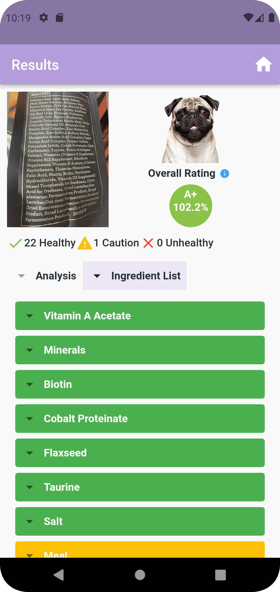

# HappyPug
Happy pug is a mobile application created to give transparency in dog food products. Simply scan the 
ingredient list of any dog food product and  the results provides the user with a detailed description 
and rating of each ingredient found in their dog food product. The user is also supplied with a pie chart 
analysis that shows the percentage of ingredients in a given category. In addition, an overall rating is 
determined by inspection of each ingredient rating and first five ingredients found.

## Implementation
Happy Pug relies on the firebase database, which is where the ingredient information is stored. Ingredient 
infromation is reserached from the AAFCO and Tailblazers Pets website to ensure accuracy of each rating and
description. Happy pug uses text recognition to scan the ingredient list and calls the database to find any
simliar ingredients. The filitering function uses string manipulation to ensure that the scanned ingredients 
and the ingredients from the databse are in the same format since comparison is case sensitive. If any similar
ingredients are found, then the results are displayed on the next screen. The overall rating system works out
of a 100, so each ingredient a certain amount of points calculated by 100 divided by the number of ingredients 
found. If a ingredient has a green rating, than it adds full points, if an ingredient is yellow, than it adds
half-points, if an ingredient is read than it adds no points. Additional bonus points are added if the first
five ingredients are green, than add another full points and if there contains a yellow, than 
subtract another half-points and if there contains a red than subtract another full points.

**Filitering Function Used**
```Dart
Future _filterIngredients() async {
    String trim_ingredients = scannedText.replaceAll(':', ','); //replace any semicolons with commas
    trim_ingredients = trim_ingredients.replaceAll('Ingredients', ','); //separate 'Ingredient
    trim_ingredients = trim_ingredients.replaceAll('(', ','); //separate '(' and ')' with commas to get actual ingredient name
    trim_ingredients = trim_ingredients.replaceAll(')', ',');
    List<String> scannedIngredients = trim_ingredients.split(","); //split ingredients after comma and store in list
    final len = scannedIngredients.length;

    //format scanned text,  first letter and second letter is capitalize capitalize the first letter
    // after space, delete all white space,
    for(var i = 0; i < len; i++){
      scannedIngredients[i] = scannedIngredients[i].titleCase;
      scannedIngredients[i] = scannedIngredients[i].split(" ").map((str) => str.capitalize).join(" ");
      scannedIngredients[i] = scannedIngredients[i].replaceAll(new RegExp(r"\s+"), "");
      print("Scanned Text");
      print(scannedIngredients[i]);
    }
        ReCase rc_name;
    await FirebaseFirestore.instance.collection("ingredients").get()
        .then((querySnapshot) {
      print("Successfully load all ingredients");
      querySnapshot.docs.forEach((element) {
        //format ingredients in database same above to compare
        rc_name = ReCase(element.data()['name']);
        String cc_name = rc_name.camelCase;
        String formatted_name = cc_name[0].toUpperCase() + cc_name.substring(1);//uppercase first character

        //find where ingredients in database == scanned ingredients and store in map
        for (var i = 0; i < len; i++) {
          if (scannedIngredients[i] == formatted_name) {
            //Add name as key and fields as value
             results[element.data()['name']] = [element.data()['description'],
             element.data()['color'], element.data()['label']];
            break;
          }
        }
      });
    }).catchError((error){
      print("Fail to load all ingredients");
      print(error);
    });

    print("Common ingredients found: ");
    print(results.keys);
    seperateByColorIngredients();  //filter ingredients by color
    setPieChartData();  //filter ingredients by label
  }
  ```
## Technologies
Project is created with 
* IDE:  Flutter 
* Version: 3.0.1
* Language: Dart

## Sample Output


## Status
App available on the Google Play Store\
This is a project created by @MadCodes9 :grinning:\
View app's landing page\
https://madrigalceiara.wixsite.com/website


